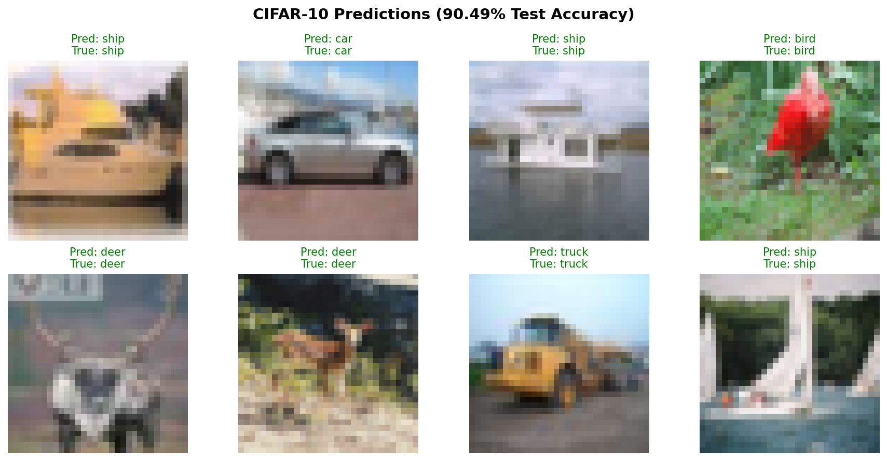
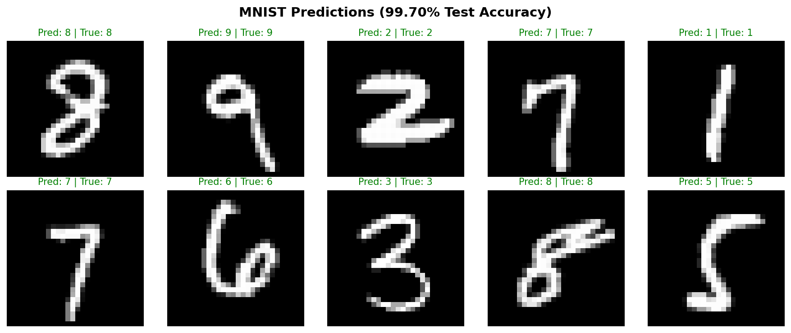

# 🖼️ CNN Image Classification with PyTorch

A clean, modular PyTorch implementation of Convolutional Neural Networks for image classification on CIFAR-10 and MNIST datasets.


## 📊 Results

| Dataset   | Model       | Parameters | Test Accuracy | Training Time |
|-----------|-------------|------------|---------------|---------------|
| CIFAR-10  | CIFAR10Net  | 288K       | **90.49%**    | ~13 min (GPU) |
| MNIST     | MNISTNet    | 241K       | **99.70%**    | ~6 min (GPU)  |

### Sample Predictions





### Per-Class Accuracy

<details>
<summary>CIFAR-10 Classes</summary>

| Class  | Accuracy |
|--------|----------|
| Plane  | 90%+     |
| Car    | 95%+     |
| Bird   | 85%+     |
| Cat    | 80%+     |
| Deer   | 88%+     |
| Dog    | 82%+     |
| Frog   | 95%+     |
| Horse  | 90%+     |
| Ship   | 95%+     |
| Truck  | 94%+     |

</details>

<details>
<summary>MNIST Digits</summary>

| Digit | Accuracy |
|-------|----------|
| 0     | 99.9%    |
| 1     | 100.0%   |
| 2     | 99.8%    |
| 3     | 100.0%   |
| 4     | 99.6%    |
| 5     | 99.6%    |
| 6     | 99.5%    |
| 7     | 99.5%    |
| 8     | 99.6%    |
| 9     | 99.5%    |

</details>

## 🏗️ Architecture

### CIFAR-10 CNN (6 Conv Layers)
```
Input (3×32×32)
    ↓
[Conv3×3 → BN → ReLU] × 2 → MaxPool  (32 filters)
    ↓
[Conv3×3 → BN → ReLU] × 2 → MaxPool  (64 filters)
    ↓
[Conv3×3 → BN → ReLU] × 2 → MaxPool  (128 filters)
    ↓
Global Average Pooling → FC(128→10)
    ↓
Output (10 classes)
```

**Key Features:**
- ✅ Batch Normalization for stable training
- ✅ Global Average Pooling (reduces parameters & overfitting)
- ✅ Data Augmentation (RandomAffine, HorizontalFlip)
- ✅ Cosine Annealing LR Schedule
- ✅ GPU Acceleration (CUDA)

## 🚀 Quick Start

### Installation
```bash
git clone https://github.com/Cleffa-00/pytorch-cnn-mnist-cifar10.git
cd pytorch-cnn-mnist-cifar10
pip install -r requirements.txt
```

### Training

**CIFAR-10** (50 epochs, ~13 min on GPU):
```bash
python train_cifar.py --epochs 50
```

**MNIST** (30 epochs, ~6 min on GPU):
```bash
python train_mnist.py --epochs 30
```

### Custom Options
```bash
python train_cifar.py --epochs 100 --batch-size 256 --lr 0.1 --data-dir ./data
```

### Quick Inference Demo

Run predictions without training (uses pre-trained weights):
```bash
python predict.py
```

Output:
```
🚀 PyTorch CNN Inference Demo

==================================================
🖼️  CIFAR-10 Inference Demo
==================================================
✅ Model loaded on cuda

📊 Predictions on random test images:

  ✓ Predicted: Car 🚗       | Actual: Car 🚗
  ✓ Predicted: Ship 🚢      | Actual: Ship 🚢
  ✓ Predicted: Frog 🐸      | Actual: Frog 🐸
  ...
```

## 📁 Project Structure
```
pytorch-cnn-mnist-cifar10/
├── models/
│   ├── __init__.py
│   └── cnn.py              # CNN architectures
├── checkpoints/            # Saved models (.pth) - auto-created on training
├── data/                   # Downloaded datasets - auto-created on first run
├── train_cifar.py          # CIFAR-10 training
├── train_mnist.py          # MNIST training
├── predict.py              # Quick inference demo
├── requirements.txt
├── .gitignore
└── README.md
```

## 🔧 Training Configuration

| Parameter        | CIFAR-10 | MNIST  |
|------------------|----------|--------|
| Epochs           | 50       | 30     |
| Batch Size       | 128      | 128    |
| Learning Rate    | 0.1      | 0.1    |
| Optimizer        | SGD      | SGD    |
| Momentum         | 0.9      | 0.9    |
| Weight Decay     | 5e-4     | 5e-4   |
| LR Schedule      | Cosine Annealing | Cosine Annealing |

### Data Augmentation

**CIFAR-10:**
- Random Affine (rotation ±15°, translation 10%, scale 0.9-1.1)
- Random Horizontal Flip
- Normalization (mean=0.5, std=0.5)

**MNIST:**
- Random Affine (rotation ±15°, translation 10%, scale 0.9-1.1)
- Normalization (mean=0.5, std=0.5)

## 📈 Training Features

- 📊 Real-time progress bars with tqdm
- 💾 Automatic best model checkpointing
- 📉 Per-epoch train/test metrics
- 🎯 Per-class accuracy evaluation
- ⚡ GPU acceleration support

## 🔬 Model Loading

```python
import torch
from models.cnn import CIFAR10Net, MNISTNet

# Load CIFAR-10 model
cifar_model = CIFAR10Net()
cifar_model.load_state_dict(torch.load('checkpoints/cifar10_best.pth', weights_only=True))
cifar_model.eval()

# Load MNIST model
mnist_model = MNISTNet()
mnist_model.load_state_dict(torch.load('checkpoints/mnist_best.pth', weights_only=True))
mnist_model.eval()
```

## 🛠️ Requirements

- Python 3.10+
- PyTorch 2.0+
- torchvision
- tqdm
- CUDA (optional, for GPU acceleration)

## 📝 License

MIT License

## 🙏 Acknowledgments

- PyTorch team for the deep learning framework
- CIFAR-10 and MNIST dataset creators
